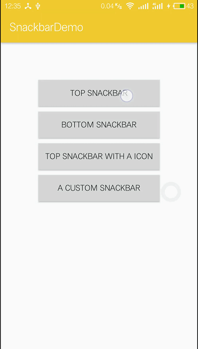
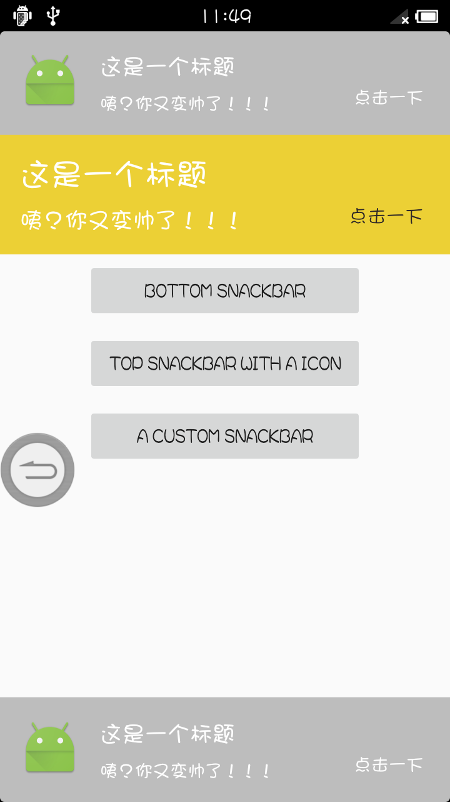

# MSnackbar
A simple android library to show message on the screen.This library based on [CookieBar](https://github.com/liuguangqiang/CookieBar)
## Screenshot
 
android 6.0  4.0

## Usage
### Gradle

```
dependencies {
   compile 'com.mnock:msnackbar:1.0.1'
}
```

### Maven
```
<dependency>
  <groupId>com.mnock</groupId>
  <artifactId>msnackbar</artifactId>
  <version>1.0.1</version>
  <type>pom</type>
</dependency>
```

## MSnackBar
```
 new MSnackBar.Builder(MainActivity.this)
                        .setTitle(R.string.cookie_title)
                        .setMessage(R.string.cookie_message)
                        .setDuration(3000)
                        .setTitleSizeTextSize(25)
                        .setMessageTextSize(18)
                        .setActionTextSize(15)
                        .setBackgroundColor(R.color.colorPrimary)
                        .setActionColor(R.color.colorAccent)
                        .setTitleColor(android.R.color.white)
                        .setAction(R.string.cookie_action, new OnActionClickListener() {
                            @Override
                            public void onClick() {
                                Toast.makeText(getApplicationContext(), "点击后，我更帅了!", Toast.LENGTH_LONG).show();
                            }
                        })
                        .show();
                        //.show(view);
```

## License

http://www.apache.org/licenses/LICENSE-2.0
